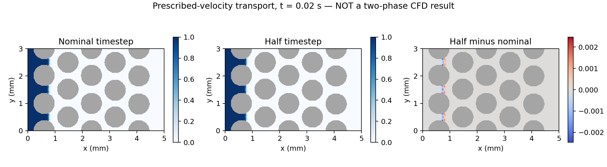

# 多孔質媒体の再開後のローカル検証

2026-09-08。気泡上昇の限定付きレビューと公開は完了済みです。
多孔質は開発中で、**論文4.4節の侵入・圧力履歴の再現は未達**です。
ユーザーの追加指示により、今回のコード・ログを検証済みの開発段階として公開します。
公開前に71テストを再実行して全件合格しました（logs/72-porous-prepublication-tests.log）。
完全な二相流ソルバーや論文再現の成功を主張する公開ではありません。

## 実装して実行した範囲

- `Transport.jl`：ACDI相流束と同じ質量流束を使うWENO3運動量輸送。
  開口面の流束を結合検査体積へ積算し、液体量と運動量を保存的に更新します。
  接触角・速度の固体内外挿は作業配列で行い、保存量を上書きしません。
- `Viscous.jl`：開口面のNewton粘性応力と円柱円弧の壁面力を足し合わせ、
  運動量予測更新へ渡します。入口は速度指定、上下はno slip、出口速度は勾配ゼロ。
- `ExplicitPressure.jl`：結合検査体積の弱圧縮圧力更新。
  出口p=0なので圧力平均を引きません。圧力緩和の固有値上限を使い音速を制限します。

71テストが合格しました（[ログ69](../logs/69-porous-viscous-predictor-tests.log)）。
元の49件に加え、相・運動量収支、一様な輸送速度の維持、滑らかな移流演算子の2次収束、
一様相分率の維持、EPP緩和の収縮、粘性体積力・外面力の収支などを調べています。
気泡ソルバーの49件とは別の件数です。気泡のソースは今回変更していません。

## 発見した不具合と修正

1. 一様な相分率0.37が1ステップで約0.001変化しました（ログ59）。
   壁内の補間による丸め誤差を界面法線として正規化していたためです。
   補間を定数が厳密に保存される差分形にし、符号付き距離の無次元勾配が1e-12以下なら
   法線をゼロにしました。相分率そのものを切り詰める修正ではありません。
2. 250×150のセル(46,12)で、円と角の接触付近の面積の桁落ちから、
   2.26e-14の孤立した流体割合が生じました（ログ61）。
   割合が正かつ1e-10未満の候補だけ256-bit精度で面積を再計算します。
   既存の64epsの丸め処理のしきい値は広げていません。論文格子の回帰検査も合格。
3. 粘性テストの数値リテラルとbroadcast演算子の隣接による構文エラー（ログ68）を修正し、
   ログ69で全件を実行しました。失敗ログは残しています。

## 所定流速による相輸送

図10の18円柱・5個の移動を保持し、診断用250×150格子で0.02秒まで実行しました。
初期界面x=0.5 mm、液体側接触角150°、入口相分率1、入口速度0.003 m/sです。
流速は一度の単相圧力投影で得た面流速に固定しています。
**粘性・表面張力・二相の圧力連成を解いた流れではありません。**
したがって、この図を論文の二相侵入形態として比較・採点してはいけません。

| 指標 | 標準の診断刻み | 半分の刻み |
|---|---:|---:|
| dt (s) | 5.65635e-5 | 2.82817e-5 |
| ステップ数 | 354 | 708 |
| 最大の相収支誤差 / 初期液体面積 | 8.08e-16 | 2.96e-15 |
| 全時刻の相分率最小値 | 0 | 0 |
| 全時刻の相分率最大値 | 1.000272397 | 1.000271918 |
| 流入液体面積の積分 (m²) | 1.8e-7 | 1.8e-7 |

終状態の相分率差は流体体積重み付きRMS=1.25120e-4、L1=1.59182e-5、最大=0.00246783。
接触線付近に差が集中します。2段階のみの比較で、時間収束次数や移動接触角の合格は主張しません。
生の相分率最大値は1を僅かに超えています。clippingはしていません。



ログ63・65、比較ログ70に対応します。元入力CSVのSHA256も比較結果に保存しました。
1250×750では輸送を**1ステップだけ**実行し、液体量収支1.12e-16、相分率最大1.000001005を確認
（ログ66）。論文格子での0.18秒計算ではありません。

## 圧力緩和と計算量

圧力行列をA、D=diag(密度/結合体積)とすると、DAの固有値上限は
Gershgorin評価で2 max(Dii Aii)です。
dt² cs² による緩和の固有値上限が1.8以下になるようcsを必要時だけ下げます。
高密度比・cut-cellで誤差のD⁻¹重み付きノルムが100回連続で増加しないことを検査しました。
これは**固定した圧力方程式の緩和の安定性**です。連成二相EPPの時間安定性の証明ではありません。
音速調整はCartesian格子の設定をそのまま流用しないための独立した実装選択です。

接触角の80回外挿で、変化しない流体域を毎回走査・コピーしていました。
固体境界の帯域だけを更新するようにし、Jacobi反復の順序を保ちました。
1250×750の同じ初期相場で旧処理とビット単位の一致を確認。
JITを除く5測定の中央値は0.209606秒→0.090687秒、約2.31倍です（ログ67）。
割当量は約7.50 MB→9.23 MBへ増えています。速度と割当量のトレードオフがあります。
これは外挿部品だけの測定で、CFD全体の高速化率ではありません。
従前の約677061毛管substepsへ単純に掛けると、この外挿だけでも約17時間です。
壁粘性側でも外挿を呼ぶ現在の構成では共有が必要で、他の演算や圧力解法も残るため、
この数字を全計算の完了予定時刻として使えません。

## 再実行

リポジトリ直下で実行します。出力先が既存なら停止し、上書きしません。

```bash
export JULIA_DEPOT_PATH="$PWD/.julia_depot:/home/uh488080/.julia"
export OPENBLAS_NUM_THREADS=1
julia --project=. porous/test/runtests.jl
julia --project=. porous/validate_transport.jl results/transport-new 250 .02 1
julia --project=. porous/validate_transport.jl results/transport-half-new 250 .02 .5
MPLCONFIGDIR="$PWD/.mplconfig" python3 porous/compare_transport.py \
  results/transport-new results/transport-half-new results/transport-comparison-new
julia --project=. porous/benchmark_contact_extension.jl \
  evidence/porous-20260908/transport-development/paper-grid-before/src results/contact-benchmark-new
```

Juliaは1.12.7、描画にはPython 3.11以上（tomllib）とNumPy・Matplotlibを使いました。
各検証の当時のソースと最新ソースは別々に保存しています。

## 次の検証と未達事項

- 現時点の予測更新・圧力補正は部品として動作しますが、CSFを含む一貫した面・セル速度更新、
  主ステップへの流束・力積累積を通した完全な二相積分器は未実装です。
- cut-cellの圧力補正とセル運動量・壁面圧力の整合を先に検査します。
  部品の保存性や圧力残差が小さいことだけで、連成系の正しさを代用しません。
- 静的接触液滴のLaplace圧力と寄生流、毛管侵入圧、実際の移動接触角は未検証です。
- 論文4.4節の1250×750・0.18秒、factor 1/16/256の比較、圧力履歴比較は未実行です。
- 圧力・輸送の作業領域の再利用、外挿の共有、連成後のCPU時間測定が必要です。
